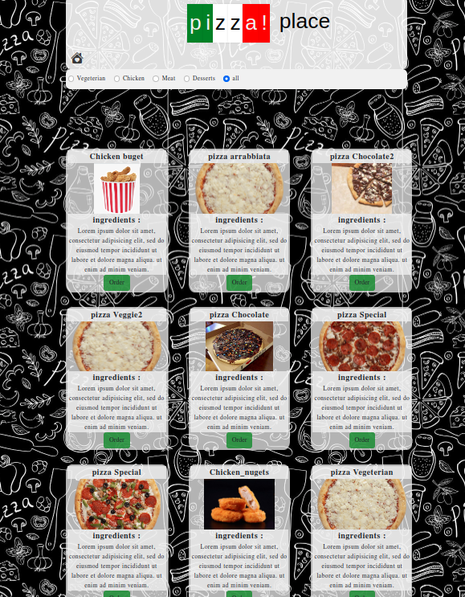

### Pizza store website

## Welcome! 👋

Thanks for checking out my project.

## Table of contents  🚀

  - [Built with](#built-with)
  - [Screenshot](#screenshot)
  - [Links](Libraries)
  - [Author](#author)

## Built-with:

For this site I used:
-[javascript](https://developer.mozilla.org/en-US/docs/Web/JavaScript)
-[css](https://developer.mozilla.org/en-US/docs/Web/CSS)
-[html](https://developer.mozilla.org/en-US/docs/Web/CSS)

## Libraries
-links and more:

-[bootstrap5](https://getbootstrap.com/)
-[anemista](https://https://animista.net/)
-[sass](https://sass-lang.com/)
-[grid system](https://getbootstrap.com/docs/4.0/layout/grid/)
-[css attributes selectores](https://developer.mozilla.org/en-US/docs/Web/CSS/Attribute_selectors)
-[mobile responsive design](https://web.dev/responsive-web-design-basics/)

### Screenshot

## Author
- Here you can see my portfolio with some of my work and contacts.

- portfolio (https://myportfolio-katesarant.netlify.app/)
- GitHub - [kate-sarant](https://github.com/kate-sarant)
- linkedin - [katerina-sarantopoulou](https://www.linkedin.com/in/katerina-sarantopoulou-4b05a51b5/)
